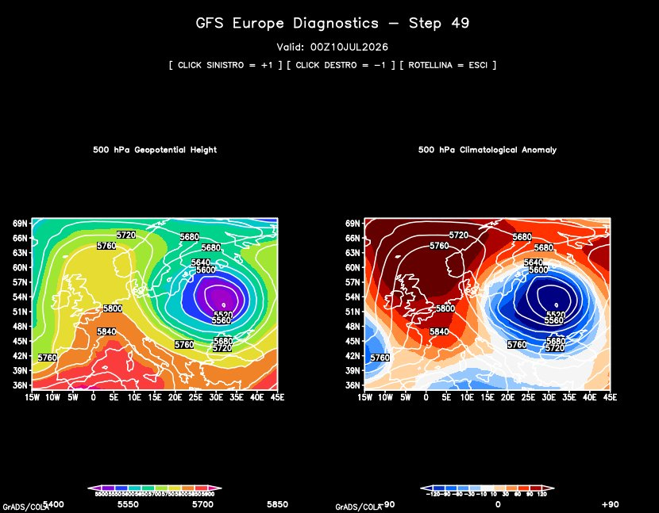

# grads-gfs-diagnostics

An integrated system for meteorological data acquisition and diagnostics. This repository provides a complete toolset to automatically download GFS forecasts and perform interactive analysis of **500 hPa Geopotential Height** and **Climatological Anomalies** over the European area using GrADS.

## Diagnostic Visualization


## Project Structure
The repository is organized as follows:

*   **`gfs_dual_player.gs`**: The main script providing a side-by-side comparison between absolute geopotential and climatological anomalies.
*   **`anomalies_player.gs`**: A specialized script for single-view climatological anomaly analysis.
*   **`hgt500_player.gs`**: A specialized script for single-view geopotential height analysis.
*   **`download_gfs.py`**: A Python utility to automate the download of GFS data required for diagnostics.
*   **`gfs.ctl`**: The control file for interpreting GFS data within GrADS.
*   **`requirements.txt`**: A list of Python dependencies required for the download script.
*   **`data/`**: Directory designated for local storage of input data files.
*   **`hgt.day.ltm.1981-2010.nc`**: NetCDF file containing the 1981-2010 reference climatology.
*   **`venv/`**: A Python virtual environment for dependency isolation.

## Getting Started

### 1. Environment Setup
Ensure you have Python installed, then create and activate the virtual environment:
```bash
python -m venv venv
source venv/bin/activate  # On Windows use: venv\Scripts\activate
pip install -r requirements.txt

```

### 2. Downloading Data

## Dataset & Data Requirements
To run the diagnostics, you need the long-term mean (LTM) geopotential height data (1981-2010). 
Due to GitHub's file size limits, this file is not included in the repository. 

**Required file:** `hgt.day.ltm.1981-2010.nc`

You can download the necessary data from the NOAA PSL Thredds catalog:
[NOAA NCEP Reanalysis LTMs - Pressure Levels](https://psl.noaa.gov/thredds/catalog/Datasets/ncep.reanalysis2/Monthlies/LTMs/Dailies/pressure/catalog.html)

*Note: The software is configured to process the European sector.*


Execute the Python script to download the latest GFS data:

```bash
python download_gfs.py

```

### 3. Visualization with GrADS

Open your GrADS terminal and run the dual-view diagnostic player:

```grads
run gfs_dual_player.gs

```

## Technical Notes

The `gfs_dual_player.gs` script is optimized for smooth, interactive exploration:

* **Mouse Control**: The player supports time-step navigation via mouse clicks, allowing for quick analysis of forecast steps.
* `Left Click`: Advance to the next time step (+1).
* `Right Click`: Return to the previous time step (-1).
* `Mouse Wheel`: Exit the application.


* **Graphic Clarity**: By utilizing `set xlabs off` and `set ylabs off`, the visualization remains free from numeric axis overlaps, ensuring a professional, clean output ready for analysis.

---

*This project is designed to streamline weather diagnostics workflow for meteorologists and enthusiasts using the GrADS framework.*

```

```